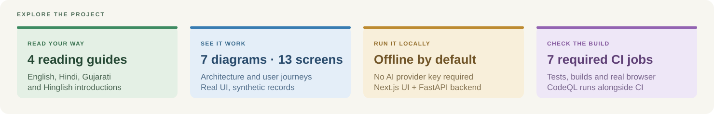

<div align="center">


# 🌿 MATRIVA

### Evidence for your questions. A workspace for your week.

**Pregnancy education · care planning · everyday records · personal data controls**

मातृ देखभाल, समझ के साथ · માતૃત્વની સંભાળ, સમજ સાથે

[](https://github.com/neevmodh/MATRIVA/actions/workflows/ci.yml) [](https://github.com/neevmodh/MATRIVA/actions/workflows/codeql.yml) [](./docs/local-rag.md) [](./docs/clinical-review.md)

**Read this project in:** [English](./README.md) · [हिन्दी](./docs/translations/README.hi.md) · [ગુજરાતી](./docs/translations/README.gu.md) · [Hinglish](./docs/translations/README.hinglish.md)

[Experience](#the-experience) · [Language support](#language-support) · [Technology](#languages-and-technology) · [Architecture](#architecture) · [Quickstart](#run-locally) · [Visual atlas](./Material/README.md) · [Docs](#documentation)

</div>

> [!IMPORTANT]
> This is a development and demonstration project. Clinical review of the care rules and safety content is pending, and Hindi/Gujarati safety wording needs native-speaker review. It does not diagnose, prescribe or replace a clinician. Read the [review requirements](./docs/clinical-review.md) before considering patient use.



<a id="the-experience"></a>

## 💚 The experience

MATRIVA brings pregnancy education, a visit plan and everyday records into a chat workspace for mothers and the people supporting them. Questions can be entered in English, Hindi, Hinglish or Gujarati. Retrieved answers currently remain in English; translated safety responses have a separate review requirement.

The default retrieval engine runs locally without an AI API key. For an ordinary guidance question it uses eligible source passages, cites the evidence, or returns an insufficient-evidence response. Emergency and prohibited requests take a fixed safety path before retrieval.


| Journey | In the workspace | What it provides |
|---|---|---|
| 💬 Ask and understand | Chat, `/evidence`, `/library`, `/book`, `/map` | Source references, evidence labels, traditional book material and related topics |
| 🗓️ Plan the week | `/plan`, `/week`, `/visits` | Pregnancy dating, visit schedule and tasks from versioned care rules |
| 🌱 Check in | `/checkin`, `/check`, `/log` | Daily records, screening and safety routing |
| 📈 Track readings | `/readings` | Hb, blood pressure, weight and glucose records; trends and report import |
| 🥗 Record food | `/meals`, `/foods` | Meal parsing, approximate nutrients and diet/allergy-aware food lists |
| 📋 Prepare for a visit | `/summary` | A printable summary assembled from the care profile and records |
| 🔐 Control personal data | Settings | Storage consent, safety profile, JSON export and deletion controls |
| 📚 Review evidence | Admin → Documents | Upload, preview, indexing status and a human review queue |

Care thresholds and schedules are source-labelled files with clinical review pending. Nutrient calculations are estimates. Reminders currently appear while the app is open; push and SMS delivery are not implemented.

### 📸 Inside the application

These are captures of the running frontend and API using synthetic accounts and records. They include no patient data. The [capture manifest](./Material/capture-manifest.json) records the source revision, capture date and viewports.

| Chat workspace | Weekly plan |
|---|---|
|  |  |

| Health readings | Food guide |
|---|---|
|  |  |

<details>
<summary>More screens: onboarding, meals, doctor summary, safety, privacy and mobile</summary>

The [complete gallery](./Material/README.md#application-captures) includes 13 desktop and mobile screens, including the source-review queue. Every screenshot is reproducible with the included capture tools.

| Meal journal | Doctor summary |
|---|---|
|  |  |

| Safety routing | Privacy controls |
|---|---|
|  |  |

</details>

<a id="language-support"></a>

## 🌐 Language support

**Documentation language and application language are separate.** The translated guides explain the project and setup. The current UI has English, Hindi and Gujarati language options; Hinglish is supported as an input style.

| Language | Example input | Current application behavior | Read the guide |
|---|---|---|---|
| 🌐 **English** | “What foods should I eat this week?” | Questions, source-based answers and safety responses in English | [English](./README.md) |
| 🇮🇳 **हिन्दी · Hindi** | “इस सप्ताह मुझे क्या खाना चाहिए?” | Hindi questions and translated safety/refusal wording; retrieved answers currently remain in English | [हिन्दी मार्गदर्शिका](./docs/translations/README.hi.md) |
| 🇮🇳 **ગુજરાતી · Gujarati** | “આ અઠવાડિયે મારે શું ખાવું જોઈએ?” | Gujarati questions and translated safety/refusal wording; retrieved answers currently remain in English | [ગુજરાતી માર્ગદર્શિકા](./docs/translations/README.gu.md) |
| 💬 **Hinglish** | “Is week mujhe kya khana chahiye?” | Roman Hindi/mixed English input; source-based answers currently remain in English | [Hinglish guide](./docs/translations/README.hinglish.md) |

Hindi and Gujarati clinical safety wording needs native-speaker review. The translated documentation is an introductory guide, not clinical validation. See the [language implementation](./frontend/lib/language.ts), [multilingual safety tests](./backend/tests/test_multilingual_safety.py) and [FAQ](./docs/faq.md).

<a id="languages-and-technology"></a>

## 🎨 Languages and technology

Explore all eight source languages and their roles in the repository.

<div align="center">

   

   

</div>

| Language or format | Where it belongs |
|---|---|
| 🐍 Python | FastAPI, safety, retrieval, care, ingestion, evaluations and tooling |
| 🔷 TypeScript | React components, Next.js routes, API contracts and browser tests |
| 🟨 JavaScript | Frontend configuration and Playwright capture tooling |
| 🟪 CSS | The interface's typography, spacing, colors and responsive layout |
| 🐚 Shell | Backend container startup and migration orchestration |
| 🐳 Dockerfile | Reproducible frontend and backend container builds |
| 🧩 Mako | Alembic migration-file template |
| 🧭 Mermaid | Editable architecture, workflow and user-journey graphs |
| 📄 YAML · JSON · Markdown · SVG | Reviewable rules, structured data, documentation and vector graphics |

**Runtime stack:** Next.js 16 · React 19 · FastAPI · SQLAlchemy · LangChain · PostgreSQL/pgvector · Redis · Docker. [Configuration](./docs/configuration.md) explains optional providers and environments.

<a id="architecture"></a>

## 🏗️ Architecture

The application is a **modular monolith**: one Next.js workspace talks to one FastAPI service. Safety, retrieval and deterministic care services have separate modules behind the API. SQLAlchemy supports SQLite for local development and PostgreSQL with pgvector for production. Redis supplies shared production quotas.


| Layer | Implementation | Responsibility |
|---|---|---|
| Interface | Next.js 16, React 19, TypeScript, Tailwind CSS | Chat, inline care cards, responsive layouts and staff views |
| API boundary | FastAPI, Pydantic, JWT | Validation, ownership/roles, CORS, quotas, request IDs and metrics |
| Safety | Classifier, guard-rail registry, output checks | Fixed escalation/refusal, consented personal checks and final validation |
| Local retrieval | Hybrid index and extractive composer | Offline evidence retrieval, sufficiency checks and numbered citations |
| Optional external retrieval | LangChain, Groq, Gemini; optional Tavily | Provider-backed retrieval/generation with explicit evidence handling |
| Care services | Python plus versioned YAML/JSON | Dating, plans, screening, readings, meals and summaries |
| Persistence | SQLAlchemy, Alembic, PostgreSQL/pgvector | Accounts, consent, care, conversations and knowledge records |
| Operations | Docker Compose, Redis, GitHub Actions, CodeQL | Runtime services, shared limits and automated verification |

### 🔄 How an answer is made

1. Authenticate and validate the request; apply shared quotas.
2. Classify risk and apply personal guard rails when consent permits. Blocking or urgent decisions return fixed messages without retrieval.
3. Resolve the question and prepare a safe turn. Supported plain statements can instead record a consented care action.
4. Retrieve evidence with the selected engine and check whether it is sufficient.
5. Compose a cited local answer, or generate from an external context packet.
6. Validate output and citations, persist the conversation and return JSON or the validated final streaming event.

The streaming client applies the final event even when it replaces earlier deltas. See the [working flowchart](./Material/diagrams/working-flow.svg) and [SSE contract](./docs/api.md#streaming-chat).

The [RAG pipeline diagram](./Material/diagrams/rag-pipeline.svg) follows reviewed documents through hybrid retrieval, ranking, evidence checks and cited answers. Download the [high-resolution PNG](./Material/diagrams/rag-pipeline.png) or [editable Mermaid graph](./Material/diagrams/rag-pipeline.mmd).

### 🧭 The user journey


The [visual atlas](./Material/README.md#diagram-atlas) also contains the [source-review workflow](./Material/diagrams/source-review.svg), [production deployment](./Material/diagrams/deployment.svg) and [privacy/deletion flow](./Material/diagrams/privacy-flow.svg). Each diagram has SVG, high-resolution PNG and editable Mermaid versions.

<a id="run-locally"></a>

## 🚀 Run locally

Use **Python 3.11 or 3.14**, **Node.js 24** and npm. The first setup below uses SQLite and offline retrieval; Docker and provider keys are optional.

```bash
git clone https://github.com/neevmodh/MATRIVA.git
cd MATRIVA
```

**Terminal 1 — API**

```bash
cd backend
python3.11 -m venv .venv       # python3.14 is also supported
source .venv/bin/activate
python -m pip install -r requirements-dev.txt
cp .env.example .env          # first setup only
```

Generate a unique secret with `python -c "import secrets; print(secrets.token_urlsafe(48))"` and set it as `JWT_SECRET` in `backend/.env`. Keep `RAG_ENGINE=local`. Then run:

```bash
alembic upgrade head
uvicorn app.main:app --reload --host 127.0.0.1 --port 8010
```

**Terminal 2 — interface**

```bash
cd frontend                  # from the repository root
npm ci
printf 'NEXT_PUBLIC_API_URL=http://localhost:8010\n' > .env.local  # first setup only
npm run dev
```

Open **http://localhost:3000**. The API health endpoint is **http://localhost:8010/health**, and its interactive API reference is **http://localhost:8010/docs**. Create an account, complete the consented profile and try `/plan`, `/readings` or `/foods`.

**A fresh database has no approved chat corpus.** Care tools and safety routing work, while ordinary source-based answers can correctly say that evidence is insufficient. Follow the [knowledge-loading instructions](./docs/deployment.md#what-the-image-does-not-contain); uploaded documents start pending. Only approve actual sources after the appropriate review.

For photographed report import, install Tesseract locally; the backend Docker image includes it. For environment variables and optional Groq/Gemini configuration, see [configuration](./docs/configuration.md).

### Docker and production

For the development stack, copy the root `.env.example` to `.env`, configure its database credentials and a unique JWT secret, then run `docker compose up --build`.

Production uses `docker-compose.prod.yml` with PostgreSQL, authenticated Redis, the non-root API and the Next.js standalone image. Its service ports are internal: configure public HTTPS ingress and the browser-visible API URL yourself. Production quotas fail closed if Redis is unavailable. Read the [deployment guide](./docs/deployment.md) and [deployment diagram](./Material/diagrams/deployment.svg).

<a id="evidence-safety-and-privacy"></a>

## 🛡️ Evidence, safety and privacy

**Source eligibility is explicit.** Ordinary corpus retrieval requires active, approved documents and approved sources. Uploading, OCR, indexing and administrative approval are separate steps. Administrative approval alone is not clinical certification. Traditional material remains labelled separately from modern evidence.

**Safety has multiple checks.** The classifier and guard rails run before retrieval. The registry contains 1,231 rules, and output validation checks dangerous claims and citation integrity. These are software controls whose clinical content still needs review. [Safety model](./docs/safety.md) · [Guard-rail details](./docs/guardrails.md).

**Consent and deletion have different scopes.** Health-profile and care writes require consent. Withdrawing consent or deleting the health profile purges profile/care records while retaining chat history. Account deletion removes the account and associated personal records. The JSON export provides account, profile, care and conversation data. [Privacy guide](./docs/privacy.md) · [Privacy flowchart](./Material/diagrams/privacy-flow.svg).

**Provider use is optional.** Local RAG runs without external generation or embedding calls. External mode and optional LangSmith tracing require deliberate configuration; review the [observability guide](./docs/observability.md) before enabling trace uploads for sensitive input. Documentation captures disable provider keys and tracing entirely.

Known limits include imperfect book OCR, estimated nutrition values, unreviewed multilingual warning wording and retrieval gaps. [Data sources](./docs/data-sources.md), [measured retrieval results](./docs/local-rag.md) and the [roadmap](./docs/roadmap.md) describe these in detail. No software test result constitutes clinical validation.

<a id="verification"></a>

## ✅ Verification

| Suite | Tests | Coverage |
|---|---:|---|
| Backend | 577 | Auth, privacy, migrations, safety, RAG, streaming, care and tracing |
| Ingestion | 43 | Extraction, chunking, provenance and source processing |
| Evaluation | 36 | Evaluation harnesses and reporting |
| Mocked browser tests | 12 | Frontend behavior and API contracts |
| Production browser integration | 1 | Actual Docker frontend/API, consent, care, safety and privacy |

GitHub Actions requires seven jobs: backend on Python 3.11, backend on Python 3.14, ingestion, evaluation, frontend, browser tests and production smoke. CI includes dependency audits, Ruff, mypy, frontend lint/type checking, builds and the documentation-link check. CodeQL runs separately. Main uses protected pull requests and required checks.

```bash
# Backend, inside the activated backend environment
pytest -q
ruff check .
mypy app/

# Frontend
npm run lint
npm run typecheck
npm run build
npm run test:e2e

# Repository root
python3 scripts/check_docs.py
python3 scripts/docker_smoke.py --browser
```

See [testing](./docs/testing.md) for suite isolation, dependencies and the limits of each check. Live status is available in [Actions](https://github.com/neevmodh/MATRIVA/actions).

<a id="repository-map"></a>

## 🗂️ Repository map

```text
MATRIVA/
├── Material/       Diagram atlas, real screenshots, capture tools and original PDFs
├── frontend/       Next.js workspace and browser tests
├── backend/        FastAPI, safety, retrieval, care, models, migrations and tests
├── ingestion/      Document extraction and provenance pipeline
├── evaluation/     Evaluation harnesses and retrieval question sets
├── knowledge/      Source material and curated datasets
├── database/       Demo seed tooling
├── docs/           Architecture, API, review, privacy and deployment guides
├── scripts/        Documentation checks and production smoke validation
└── .github/        CI, CodeQL, ownership and contribution templates
```

<a id="documentation"></a>

## 📚 Documentation

| Start here | Read |
|---|---|
| Understand the project visually | [Material atlas and screenshot gallery](./Material/README.md) |
| Develop or integrate | [Architecture](./docs/architecture.md) · [API](./docs/api.md) · [Configuration](./docs/configuration.md) |
| Understand the product | [Care features](./docs/care-features.md) · [Food guide](./docs/food-guide.md) · [FAQ](./docs/faq.md) |
| Review clinical content | [Clinical review](./docs/clinical-review.md) · [Data sources](./docs/data-sources.md) · [Safety](./docs/safety.md) |
| Work on retrieval | [Offline RAG](./docs/local-rag.md) · [RAG pipeline](./docs/rag.md) · [Observability](./docs/observability.md) |
| Operate the application | [Deployment](./docs/deployment.md) · [Privacy](./docs/privacy.md) · [Security](./SECURITY.md) |
| Contribute | [Contributing](./CONTRIBUTING.md) · [Progress](./PROGRESS.md) · [Roadmap](./docs/roadmap.md) |

The [documentation index](./docs/README.md) lists all guides, including historical submission and sprint documents.

<a id="team"></a>

## 🤝 Team

| Contributor | Workstream |
|---|---|
| [@neevmodh](https://github.com/neevmodh) | Retrieval, AI, safety, testing and review |
| [@BhavyaSoneji](https://github.com/BhavyaSoneji) | Backend, database and API |
| [@Rajodedra](https://github.com/Rajodedra) | Frontend and interface |

Ownership is recorded in [CODEOWNERS](./.github/CODEOWNERS). Read [CONTRIBUTING](./CONTRIBUTING.md) before changing behavior or source content, and report vulnerabilities through [SECURITY](./SECURITY.md).

**License:** no license has been selected; the repository currently reserves all rights.

<div align="center">

🌿 **MATRIVA · मातृ · માતૃ**

[Explore all project material](./Material/README.md) · [Contribute](./CONTRIBUTING.md) · [Report a security issue](./SECURITY.md)

</div>
