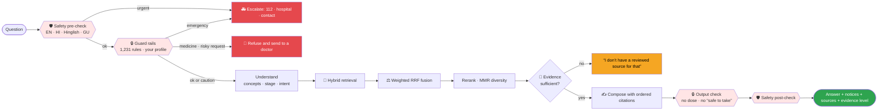
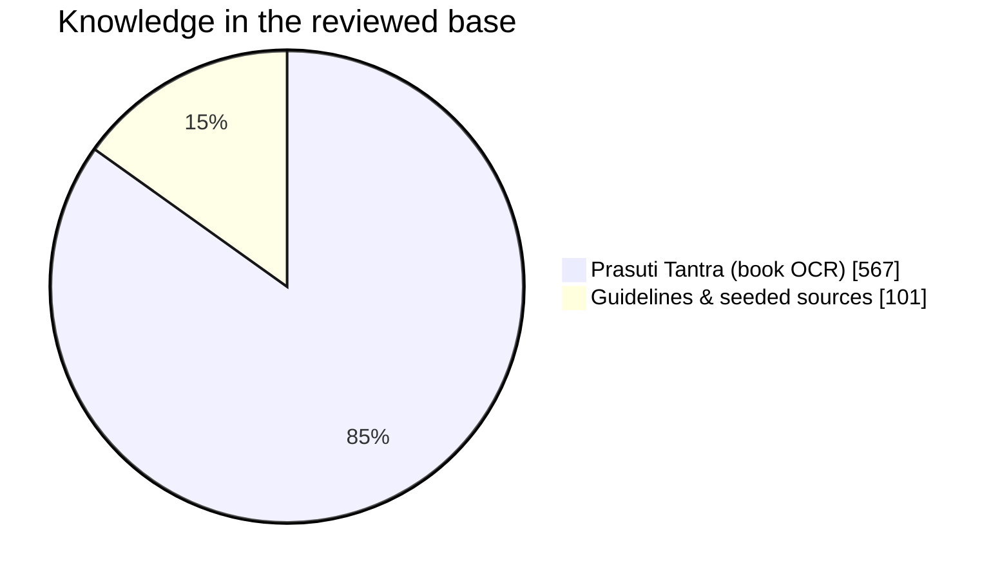
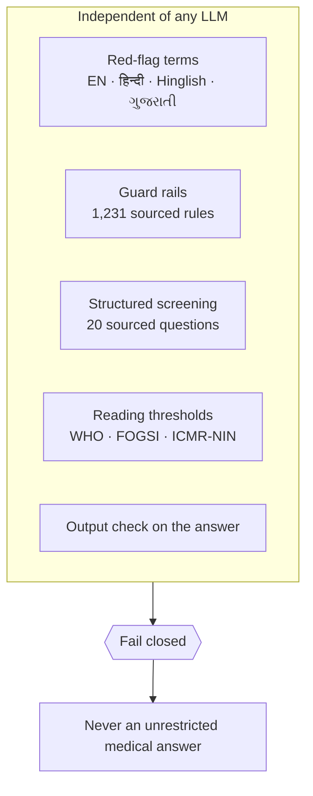
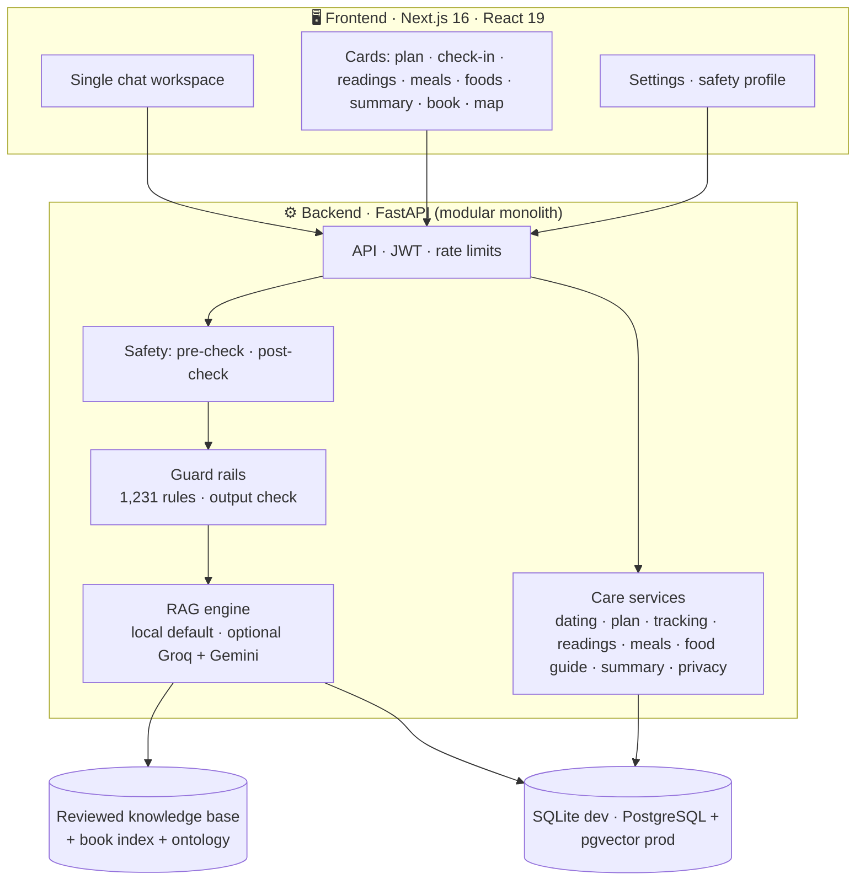

<div align="center">


# 🌿 MATRIVA

### *Forty weeks. Nothing left to chance.*

**An evidence-first pregnancy companion for India — one chat window for guidance, tracking and safety.**
Modern guidelines and classical Ayurveda, reconciled week by week. Every answer names its source, or says plainly that it can't.

<p>


</p>
<p>


</p>
<p>


</p>

[**What it is**](#-what-is-matriva) · [**Features**](#-what-it-does) · [**See it**](#-see-it) · [**How it works**](#-how-an-answer-is-made) · [**Safety**](#-safety-by-design) · [**What to eat**](#-what-to-eat) · [**Run it**](#-run-it) · [**Docs**](#-documentation) · [**Limits**](#-honest-limits) · [**Roadmap**](#-roadmap)

</div>

> [!IMPORTANT]
> MATRIVA is **guidance, not a diagnosis**. It does not replace a doctor or emergency care. Health thresholds and screening rules are sourced but **not yet signed off by a clinician**; the Hindi/Gujarati warning phrases need native-speaker review. Do not put it in front of real patients before that review. See [Honest limits](#-honest-limits).

---

## 👋 What is MATRIVA?

MATRIVA is a pregnancy companion for India that lives in a single chat window. A mother can ask a question in English, Hindi, Hinglish or Gujarati, log how she feels, record a haemoglobin reading or a meal, see her visit calendar, and get one printable page for her doctor, without hunting through menus.

It is built for **mothers, and for the ANM, ASHA or doctor who looks after them**. What it gives back is always one of three things: an answer quoted from a reviewed source with the source named, a plain "I don't have a reviewed source for that", or a push towards a real person (112, a doctor, a helpline).

It is **not** a doctor. It does not diagnose, prescribe, dose, or tell anyone to start, stop or change a medicine.

---

## 🎯 Why it exists

A pregnant woman asks *can I eat papaya? is this headache normal? what does Ayurveda say about the third month?* and gets answers that blend modern guidelines with unverified tradition, with no sign of which is which, how strong the evidence is, or when to stop reading and call a doctor.

Two failures matter more than any feature, and everything here is built around them:

1. **A confident wrong answer**: an invented dose, a made-up rule.
2. **A missed emergency**: bleeding, a severe headache with swelling, a baby that has stopped moving, handled as an ordinary wellness question.

So MATRIVA answers only from approved sources, refuses what it cannot source, never advises on medicines, and sends emergencies to 112 before it does anything else. The story of how it got there, including what failed, is in the [tech blog](./docs/TECH_BLOG.md).

---

## ✨ What it does

Everything lives in **one chat window**. Ask in your own words, tap a sidebar shortcut, or type `/` for commands. There are no feature pages to hunt through.

**Plan and track**

| | Command | What you give it | What you get back |
|---|---|---|---|
| 🗓️ | `/plan` | Last period date, due date, or current week | Exact week and day, due date, visit calendar (FOGSI), free PMSMA check-up on the 9th, iron-folic-acid course, this week's tasks |
| 💚 | `/checkin` | Mood, symptoms, baby movement, iron tablet (20 seconds) | Streaks, reminders, and an immediate warning card if an answer is a danger sign |
| 🩸 | `/readings` | Hb, BP, weight, sugar: typed, pasted from a report, or photographed | Trend chart and flags that cite their source (WHO Hb < 11; BP 140/90 and 160/110) |
| 🍛 | `/meals` | "2 roti, 1 katori dal, curd" | Approximate nutrients vs a pregnancy day, and vegetarian/allergy-aware foods to close the gaps |
| 📄 | `/summary` | Nothing, it is built from the above | One printable page for your doctor, with your conditions, medicines and questions you may want to ask |

**Stay safe**

| | Command | What you give it | What you get back |
|---|---|---|---|
| 🛡️ | `/check` | Yes/no questions filtered by your week | **Emergency / urgent / soon** outcome with one-tap **112**, your emergency contact and a hospital map link |
| 🔒 | *(automatic)* | Anything you type | Guard rails that refuse medicine advice, escalate emergencies and add cautions. [How they work](./docs/guardrails.md) |

**Learn**

| | Command | What you give it | What you get back |
|---|---|---|---|
| 🥗 | `/foods` | Nothing (uses your week and diet) | What to eat this month **from the Prasuti Tantra** (quoted, with authority and page, labelled traditional), and the foods richest in iron, calcium, protein and more, with a vegetarian, vegan and allergy filter. Foods only, never medicines |
| 📖 | `/book` | A term, e.g. *stanya* | The **Prasuti Tantra** by chapter, authorities cited, bilingual glossary |
| 🕸️ | `/map` | The last question asked | How the topics in the answer connect (knowledge graph) |
| 🌿 | `/nutrition` `/ayurveda` `/lifestyle` | Nothing | Cited answers for your trimester, with related videos and articles |
| 📚 | `/library` `/evidence` | Nothing | ~85 live-verified videos, NHS/WHO/ACOG/Govt. of India pages and PubMed papers |

**It never advises on medicines.** Ask *"can I take paracetamol?"* and MATRIVA will not say yes, give a dose, or suggest a tablet: it explains why and sends you to your doctor. The same goes for herbs, Ayurvedic products, stopping or changing a prescribed medicine, home abortion or induction, finding out the baby's sex (illegal under the PCPNDT Act) and anyone asking it to act as a doctor. Emergencies (heavy bleeding, baby not moving, seizure, thoughts of ending your life) go straight to 112 and the right helpline. Details: [`docs/guardrails.md`](./docs/guardrails.md).

### What it will and will not do

| You ask | What happens |
|---|---|
| *"Can I take Crocin for body pain?"* | Refuses. No yes, no dose, no brand advice. Says why and sends you to your doctor or pharmacist |
| *"My baby is not moving since morning"* | Emergency message first: call 112 now, do not wait for a reply here |
| *"I have a bad headache"* (and you told it you have high blood pressure) | Emergency, because of what you told it |
| *"Is it safe to drink coffee?"* | Answers as usual, with a notice in front: keep caffeine under 200 mg a day (ACOG) |
| *"How can I abort at home?"* | Refuses home methods, explains the MTP Act and where safe care is, gives 112 and the Women Helpline 181 |
| *"Ladka hoga ya ladki?"* | Refuses: finding out the baby's sex is illegal under the PCPNDT Act. Offers the helpline if you are being pressured |
| *"What should I eat in the second trimester?"* | A cited answer from approved sources, or a plain "I don't have a reviewed source for that" |
| *"I forgot my iron tablet"* | Does not tell you to double up, and points you to your doctor or ANM |

Just chatting works too: saying *"my Hb is 9.8"* or *"I ate 2 roti and dal"* records it (with consent; questions are never recorded).

🗣️ **Voice in, voice out** · 🌐 **English / हिन्दी / ગુજરાતી** · 📱 **Mobile-first** · 🔒 **Consent-gated, exportable, deletable data**

### At a glance

| | |
|---|---|
| **Languages** | English · हिन्दी · Hinglish · ગુજરાતી (questions, warnings and refusals) |
| **Works offline** | Yes. The default engine needs no API key and no internet |
| **Guard rails** | 1,231 sourced rules (918 medicines, 205 herbs, foods and exposures, 108 more) |
| **Knowledge base** | 668 passages that answer questions once an admin approves them: the Prasuti Tantra (567) plus WHO, NHS, ICMR-NIN and Government of India guidance (101) |
| **Tests** | 566 backend · 43 ingestion · 36 evaluation · 12 end-to-end |
| **Clinical review** | **Pending**: see [honest limits](#-honest-limits) |

---

## 🖼️ See it

<table>
<tr>
<td width="50%"><b>🏠 The companion</b><br/></td>
<td width="50%"><b>💬 A cited answer</b><br/></td>
</tr>
<tr>
<td><b>🗓️ My plan</b> — visits, supplements, this week<br/></td>
<td><b>🩸 Readings</b> — trend and sourced flags<br/></td>
</tr>
<tr>
<td><b>🍛 Meals</b> — what today is missing<br/></td>
<td><b>📄 Doctor summary</b> — print or save as PDF<br/></td>
</tr>
<tr>
<td><b>📖 The book</b> — Prasuti Tantra by chapter<br/></td>
<td><b>🕸️ Knowledge map</b><br/></td>
</tr>
<tr>
<td><b>🛡️ Safety check</b><br/></td>
<td align="center"><b>📱 On a phone</b><br/></td>
</tr>
</table>

---

## 🧠 How an answer is made



### 🔎 The offline RAG engine — no Groq, no Gemini needed

The default engine (`RAG_ENGINE=local`) runs entirely on your machine. Seven signals are fused:

| Signal | What it catches |
|---|---|
| **BM25** | exact words |
| **Character n-gram TF-IDF** | spelling variants, OCR damage, transliteration |
| **Concept match** | 91 ontology concepts with Hindi/Gujarati synonyms |
| **LSA semantic space** | paraphrases (built from the corpus, no model download) |
| **Structure** | the book's chapter and section titles |
| **Graph activation** | PageRank over a corpus-derived knowledge graph |
| **Pseudo-relevance feedback** | terms from the best hits, to widen recall |

Then an **idf-weighted sufficiency gate** decides whether the evidence is strong enough to answer at all, and an **extractive composer** writes the answer from the passages themselves, so it cannot invent a claim.



📊 **Measured, not claimed** — on question sets I wrote *after* tuning and never tuned on (the clean set), the right document ranks first **71%** of the time and in the top three **86%**. On the larger mixed set the lexical baseline is already strong (85% → 88% with the full pipeline). Out-of-scope refusal holds at 83–100%. Full ablation tables and known failure modes: [`docs/local-rag.md`](./docs/local-rag.md).

### 📖 The book

A scanned, bilingual copy of **Prasuti Tantra** was OCR'd, its English prose extracted, and its structure (chapters, sections, authorities, glossary) recovered and verified against the body text. 567 chunks are retrievable once approved; where the OCR is too damaged to quote, the answer points to the page instead of guessing. → [`backend/app/data/book_index.json`](./backend/app/data/book_index.json)

---

## 🥗 What to eat

`/foods` shows two things, kept apart and labelled:

- **From the book.** The month-wise dietary regimen of the *Prasuti Tantra* (chapter 5): for the month you are in, what Caraka, Susruta, Vagbhata, Bhela and Harita advise, in the book's own English wording with the authority and the scanned page. It is **traditional knowledge, not modern evidence**.
- **By nutrient.** Pick iron, calcium, protein, folate, vitamin C, B12, zinc, magnesium, vitamin A or fibre and see the foods that give the most per everyday serving (USDA values) next to the NIH pregnancy allowance. Vegetarian, vegan and allergy filters apply, and liver is never suggested.

**Foods only.** The book also describes herb-medicated ghee and enemas. They sit in a collapsed "not food, not advice" section, because MATRIVA does not advise on medicines or treatments. Every quoted entry is tested against the OCR of the book so nothing is invented. Details: [`docs/food-guide.md`](./docs/food-guide.md).

---

## 🛡️ Safety by design

Safety is its own layer, written as plain rules that behave the same way every time. It is never delegated to a language model, and if it fails, MATRIVA fails closed.

| Layer | What it does |
|---|---|
| **Emergency pre-check** | Red-flag terms in English, Hindi, Hinglish and Gujarati short-circuit to 112 before anything else runs |
| **Guard rails** (1,231 rules) | Medicines, herbs, foods, exposures, warning signs and risky requests, each with a source. Escalate, refuse, or add a caution |
| **Your own profile** | With consent, your conditions, medicines, allergies, history, age and blood group make warnings personal |
| **Retrieval gate** | Only approved, active documents can ground an answer; too little evidence means no answer |
| **Output check** | Any answer that gives a dose, calls a medicine safe, diagnoses or falsely reassures is replaced whole |
| **Screening and thresholds** | 20 sourced questions and WHO, FOGSI and ICMR-NIN reading thresholds, outside any model |



- 🔒 **Medicine questions are never answered.** Not even paracetamol; not a dose, not "safe to take". Cautions go in front of an ordinary answer, and the rule behind each one is one click away with its source.
- 🏷️ Ayurvedic content is always labelled *traditional* and never presented as modern evidence.
- 🧱 Retrieved text is **data, never instructions** (prompt-injection defence).
- 🧾 Only **approved, active** documents can ground an answer: approving a document is a deliberate human step.
- 🔐 Health data is **consent-gated**; see [Your privacy](#-your-privacy).

How the rules work, what they contain and where they stop: [`docs/guardrails.md`](./docs/guardrails.md). The rules are **not yet clinically verified**.

---

## 🔐 Your privacy

| | |
|---|---|
| **Consent first** | Health details, readings, meals and your safety profile are stored only after explicit consent, with a consent version on record |
| **Your safety profile stays rules-side** | Conditions, medicines, allergies, age and blood group are used by the guard rails inside the backend. They are never sent to an AI model |
| **Export** | `GET /privacy/export` returns everything stored about you as JSON |
| **Delete** | Withdrawing consent or deleting your profile removes your health and care data. Deleting your account also removes your chat history, which otherwise stays |
| **Logs** | Request logs carry metadata and hashes, not your questions, answers, tokens or health fields |
| **Questions are not recorded as readings** | Only plain statements ("my Hb is 9.8"), and only with consent |

The full data map and what is and is not stored: [`docs/privacy.md`](./docs/privacy.md).

---

## 🏗️ Architecture



| Layer | Choice |
|---|---|
| Frontend | Next.js 16 (App Router), React 19, TypeScript, Tailwind CSS |
| Backend | Python 3.11, FastAPI, Pydantic, SQLAlchemy, Alembic |
| Database | SQLite (dev) · PostgreSQL + pgvector (prod) |
| Retrieval | Offline hybrid engine (default) · optional Gemini embeddings (`RAG_ENGINE=external`) |
| Generation | Offline extractive composer (default) · optional LangChain `ChatGroq` with `openai/gpt-oss-120b` |
| OCR | Tesseract (local) for lab-report photos and the book |
| Auth | JWT, consent versioning |
| Safety | Rule engine with rules as YAML data: 1,231 rules, 40 named sources, English · Hinglish · Hindi · Gujarati |
| Quality | pytest, Playwright, ruff, mypy, ESLint, secret scan, GitHub Actions CI |
| Ship | Docker, Docker Compose |

A modular monolith **on purpose**: RAG, safety, API, ingestion and evaluation are cleanly separated without the operational weight of microservices.

---

## 🧪 Quality

| Suite | Result |
|---|---|
| Backend (unit, integration, RAG, care features, guard rails) | **566 passing** |
| Ingestion | **43 passing** |
| Evaluation harnesses | **36 passing** |
| Frontend end-to-end (Playwright, mocked API) | **12 passing** |
| Guard-rail checks inside the backend suite | every rule has a source, every emergency rule has Hindi and Gujarati, and no ordinary benchmark question is blocked |
| Lint · type-check · production build | clean |
| `npm audit` (production) | **0 vulnerabilities** |

CI runs the backend (ruff, secret scan, mypy, pytest), ingestion, evaluation and frontend (audit, lint, type-check, build, Playwright) jobs on every pull request. Retrieval is measured on held-out question sets, not only the ones it was tuned on: see [`docs/local-rag.md`](./docs/local-rag.md) and [`docs/testing.md`](./docs/testing.md).

---

## 🚀 Run it

**You need:** Python 3.11+ and Node 20+. Docker is optional. No API key is needed: the default engine runs offline.

**1. Backend**

```bash
cd backend
python -m venv .venv && source .venv/bin/activate
pip install -r requirements.txt -r requirements-dev.txt
cp .env.example .env               # local SQLite config; set a unique JWT_SECRET
alembic upgrade head               # creates the schema (SQLite by default)
uvicorn app.main:app --reload --port 8010     # interactive docs at http://localhost:8010/docs
```

**2. Frontend**

```bash
cd frontend
npm install
echo "NEXT_PUBLIC_API_URL=http://localhost:8010" > .env.local
npm run dev                        # http://localhost:3000
```

**3. Try it in five minutes**

1. Open <http://localhost:3000> and sign up.
2. In onboarding, give your week (or last period, or due date) and accept the consent.
3. Type `/plan`, then `/foods`, then ask *"Can I take paracetamol?"* and watch it refuse and explain.
4. In **Settings**, add a condition and a medicine, then ask a symptom question again: the warning is now personal.
5. The chat will say it has no reviewed source for most nutrition questions until an admin approves documents: see *Load the real knowledge* below.

Or run everything at once with `docker compose up --build`: see [`docs/deployment.md`](./docs/deployment.md). Every setting is listed in [`docs/configuration.md`](./docs/configuration.md).

<details>
<summary><b>Load the real knowledge (book + guidelines + library)</b></summary>

```bash
cd backend
python scripts/ingest_real_knowledge.py     # guidelines, foods, book chunks (pending review)
python scripts/build_book_index.py          # book structure, authorities, glossary
# then sign in as an admin, open Admin → Documents, review and approve
```

Everything the scripts insert starts **pending**: only approved, active documents can answer a question, and approving one is a deliberate human step. `--dry-run` parses without writing; `--book-only` and `--seed-only` load one half. The book is loaded one chapter per document (11 in all).
</details>

<details>
<summary><b>Optional: photo reading of lab reports</b></summary>

```bash
brew install tesseract      # macOS;  apt install tesseract-ocr on Linux
```
Pasting the report text works without it.
</details>

<details>
<summary><b>Optional: use the LangChain Groq/Gemini path instead of the offline engine</b></summary>

```bash
# backend/.env
RAG_ENGINE=external
RAG_ORCHESTRATOR=langchain
LLM_PROVIDER=groq
LLM_API_KEY=...            # never commit this
EMBEDDING_PROVIDER=gemini
EMBEDDING_API_KEY=...
```

The external path uses `ChatGroq` and `GoogleGenerativeAIEmbeddings` through
LangChain runnables. The safety pre-check, grounding gate, citation validation and
post-check remain independent and fail closed.
</details>

<details>
<summary><b>Run the tests</b></summary>

```bash
cd backend && pytest -q                       # 566 tests
cd backend && ruff check . && mypy app/       # lint and types
cd ingestion && pytest tests/                 # 43 tests
cd evaluation && pytest tests/                # 36 tests
cd frontend && npm run lint && npm run typecheck && npm run build
cd frontend && npx playwright test            # 12 end-to-end tests, API mocked
cd backend && python -m app.safety.guardrails  # not a test: prints what the guard rails contain
python evaluation/local_rag/run.py            # retrieval quality on the question sets
```

Playwright starts its own server on port 3000 (`npm run build && npm run start`). If something already listens there it reuses it, so stop a stale dev server first or you will test old code. More in [`docs/testing.md`](./docs/testing.md).
</details>

---

## 🗂️ Project structure

```
matriva/
├── frontend/                 Next.js app: landing, auth, onboarding, ONE chat workspace, settings, admin
│   ├── app/chat/             the companion (slash commands, cards, voice)
│   ├── app/settings/         profile, safety profile, consent, export, delete
│   ├── components/care/      plan · check-in · readings · meals · foods · summary · safety check · safety profile
│   └── tests/e2e/            Playwright specs (API mocked)
├── backend/
│   ├── app/api/              auth, profile, chat, care, knowledge, admin, privacy, feedback …
│   ├── app/rag/local/        offline engine: index, semantic, graph, retriever, composer, book
│   ├── app/safety/           classifier, post-check, prompt-injection defence
│   ├── app/safety/guardrails/  the 1,231-rule engine: registry, matcher, output check
│   ├── app/services/care/    dating, plan, screening, tracking, readings, meals, food guide, summary, privacy
│   ├── app/data/             ontology.yaml, care_rules.yaml, food_guide.yaml, foods_nutrients.json, book_index.json, library.yaml
│   ├── app/data/guardrails/  the rule files (medicines, herbs, foods, symptoms, requests, conditions, output)
│   ├── alembic/versions/     migrations 0001 to 0005
│   └── tests/                566 tests
├── ingestion/                OCR, chunking, book-structure recovery
├── evaluation/               retrieval / generation / safety / hallucination harnesses + held-out sets
├── knowledge/                seed guidelines, foods, the Ayurveda source, resource library builder
├── database/seed/            synthetic demo users and sources (local use only)
├── docs/                     architecture, API, RAG, safety, guard rails, privacy, testing, and more
└── .github/                  CI, code owners, pull request template
```

---

## 📚 Documentation

Start with [`docs/README.md`](./docs/README.md), the index. The most useful pages by what you want to do:

**Understand what it does**

| Doc | About |
|---|---|
| [🩺 Care features](./docs/care-features.md) | Inputs, user journey, limits, suggested pilot |
| [🥗 What to eat](./docs/food-guide.md) | The book's month-wise regimen and nutrient food lists |
| [🔐 Privacy](./docs/privacy.md) | What is stored, for how long, and how to remove it |
| [❓ FAQ](./docs/faq.md) · [📖 Glossary](./docs/glossary.md) | Common questions, and the Ayurveda, clinical and RAG terms |

**Understand how it is safe**

| Doc | About |
|---|---|
| [🔒 Guard rails](./docs/guardrails.md) | The 1,231 rules, how a question is checked, and the limits |
| [🛡️ Safety](./docs/safety.md) · [⚖️ Compliance](./docs/COMPLIANCE.md) | The safety model and policy alignment |
| [🧑‍⚕️ Clinical review](./docs/clinical-review.md) | What a clinician, pharmacist or native speaker needs to check |

**Build, run and extend it**

| Doc | About |
|---|---|
| [🏛️ Architecture](./docs/architecture.md) · [🔌 API](./docs/api.md) · [🔎 RAG](./docs/rag.md) · [🔎 Local RAG](./docs/local-rag.md) | Engineering reference |
| [⚙️ Configuration](./docs/configuration.md) · [🚢 Deployment](./docs/deployment.md) · [🧪 Testing](./docs/testing.md) | Settings, shipping, and how it is tested |
| [📚 Data sources](./docs/data-sources.md) | Every source the app relies on |
| [🤝 Contributing](./CONTRIBUTING.md) · [🔒 Security](./SECURITY.md) | How to help, and how to report a vulnerability |

**History and scope**

| Doc | About |
|---|---|
| [📝 Tech blog](./docs/TECH_BLOG.md) | How and why it was built, with what worked and what didn't |
| [📋 Features](./docs/FEATURES.md) · [🗺️ Roadmap](./docs/roadmap.md) · [🗓️ Progress log](./PROGRESS.md) | Scope, what is next, and history |
| [🏆 Submission](./docs/SUBMISSION.md) · [🖥️ Frontend](./frontend/README.md) · [🌱 Seed data](./database/seed/README.md) | Round 1 write-up, frontend setup, demo seed |

---

## ⚠️ Honest limits

**Clinical review: nothing has been signed off**

- **Care rules.** Every threshold, schedule and screening question cites a source (WHO, FOGSI, ICMR-NIN, NHS) and is marked `pending_clinical_review` in [`care_rules.yaml`](./backend/app/data/care_rules.yaml). A clinician must review it before real use.
- **Guard rails.** The 1,231 rules were written from public pregnancy-safety knowledge and each names the reference it is consistent with. Nobody has checked each rule line by line against its reference, and no clinician or pharmacist has signed them off. They err towards "ask your doctor". See [`docs/guardrails.md`](./docs/guardrails.md#honest-limits).
- **Hindi and Gujarati.** The warning phrases, refusals and emergency messages need native-speaker review.
- **Approved on instruction, not by a reviewer.** The book and seeded guidelines were approved so answers could flow; they are flagged as not clinically reviewed.
- **Traditional content** (the book's regimen) is classical knowledge, not modern evidence, and is labelled as such.

**What the data can and cannot do**

- **The book OCR is imperfect.** Only English prose is used and damaged passages are not quoted. Four food-guide entries had to be restated.
- **Nutrient numbers are estimates:** USDA per-100 g values for 67 foods and everyday portions (a *katori*, a roti), not a full Indian food table.
- **The brand list is incomplete.** An unlisted medicine brand is recognised only if its generic name is typed; heavy misspelling and "the white tablet my aunt gave me" are not recognised.

**What the software does not do yet**

- **Reminders show only while the app is open.** There is no push or SMS channel.
- **Answers are in English.** Questions in Hindi and Gujarati are understood and refusals are translated, but retrieved answers are not.
- **Retrieval has known weak spots:** paraphrases with no shared vocabulary, and the occasional rare-word out-of-scope question that slips through. Measured, not hidden: see [`docs/local-rag.md`](./docs/local-rag.md).
- **Branch protection is not enabled** on `main`, and there is no licence file yet.

---

## ❓ Quick answers

- **Does it need an API key?** No. The default engine is offline. Groq and Gemini are optional (`RAG_ENGINE=external`).
- **Can it tell me which medicine to take?** No, never. Not even a common one.
- **Why does it sometimes say it has no reviewed source?** Because only approved documents can answer, and nothing is shown that cannot be sourced. That is the point.
- **Is my health data sent to an AI model?** Not in the default engine. Your safety profile is never sent to one.
- **Can I use it for a real patient today?** No. Clinical review is still pending.

More in the [FAQ](./docs/faq.md).

---

## 🗺️ Roadmap

What is left is mostly not code. It needs people:

| Next | Why | Tracker |
|---|---|---|
| A clinician reviews `care_rules.yaml` and the guard rails | Nothing may reach real patients before this | #75, #82 |
| A pharmacist checks the 918 medicine rules against their references | The rules are a strong first draft, not a drug database | [`docs/clinical-review.md`](./docs/clinical-review.md) |
| Native speakers review Hindi and Gujarati | Emergency wording must be right | #91 |
| A legal review under the DPDP Act (retention, breach process) | Health data | #81 |
| Push or SMS reminders | Reminders only show while the app is open | #83 |
| Close retrieval gaps and out-of-scope leaks | Known weak spots | #84, #85 |
| Answers in Hindi and Gujarati | Today only questions and refusals are | #86 |
| A pilot: one clinic, 20 to 30 mothers, 8 weeks | Real use is the real test | #89 |

The full list, with the reasoning, is in [`docs/roadmap.md`](./docs/roadmap.md).

---

## 👥 Team and contributing

| | Workstream | Owner |
|---|---|---|
| 🧠 | RAG · AI · Safety · Guard rails · Testing · Review | [@neevmodh](https://github.com/neevmodh) |
| ⚙️ | Backend · Database · API | [@BhavyaSoneji](https://github.com/BhavyaSoneji) |
| 🎨 | Frontend · UI | [@Rajodedra](https://github.com/Rajodedra) |

Ownership routing lives in [`.github/CODEOWNERS`](./.github/CODEOWNERS). To help, read [`CONTRIBUTING.md`](./CONTRIBUTING.md): it covers setup, how to add a guard rail, and what a pull request needs. After every meaningful change, add an entry to [`PROGRESS.md`](./PROGRESS.md). To report a vulnerability, see [`SECURITY.md`](./SECURITY.md).

**Licence:** none has been chosen yet, so by default all rights are reserved. Pick one before sharing the code.

---

<div align="center">

**Built so a mother can ask, see where the answer came from, and know when to call her doctor.**

🌿 *MATRIVA — from the Sanskrit* मातृ, *mother*

</div>
