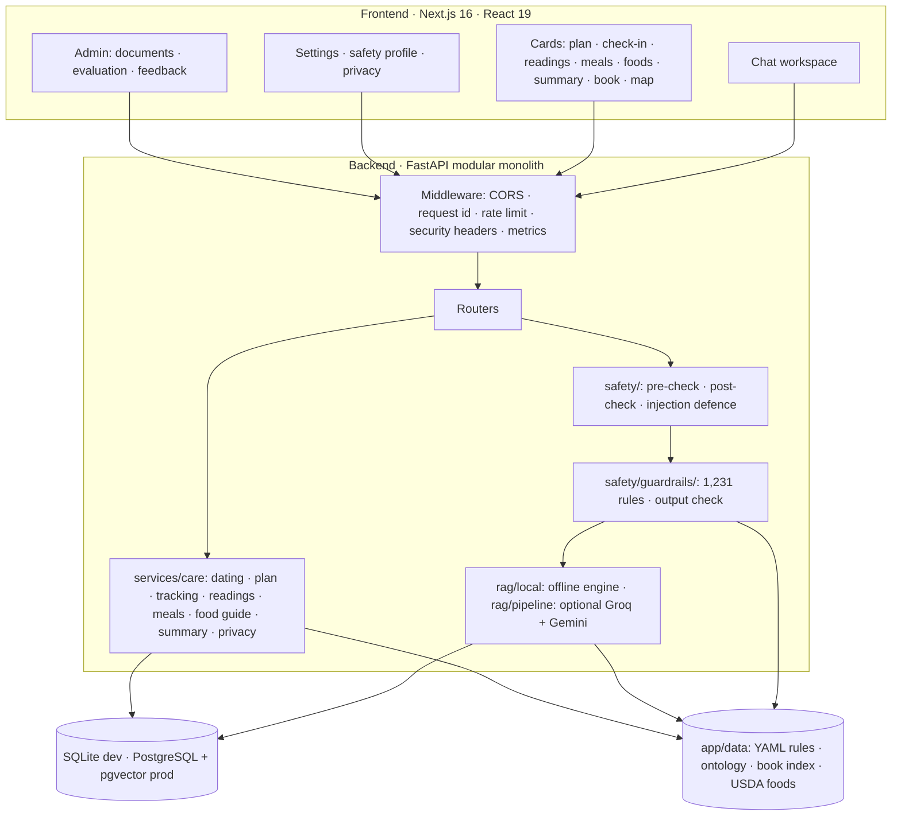

# Architecture

The [Material visual atlas](../Material/README.md) provides six diagrams with SVG, PNG and editable Mermaid exports, plus captures of the running application.


MATRIVA is one chat workspace in front of one FastAPI backend. Everything that decides what a patient is told, the safety rules, the retrieval, the guard rails and the care logic, runs in the backend, in code and data that can be read and tested.



## Modules

| Folder in `backend/app/` | Responsibility |
|---|---|
| `api/` | HTTP routers: auth, profile, chat, care, knowledge, recommendations, resources, wellness, privacy, feedback, admin, evaluations |
| `core/` | Settings, database, security (hashing, JWT), rate limiter, Redis client, observability |
| `safety/` | Pre-check classifier, post-check validator, prompt-injection defence |
| `safety/guardrails/` | The rule engine: registry loader, matcher, request context, output check |
| `rag/local/` | The offline engine: index, semantic space, graph, retriever, composer, book |
| `rag/` (other files) | The optional external pipeline: query rewriting, hybrid retrieval, reranking, context packet, translation |
| `llm/` | Groq client, prompts, grounded generator (external engine only) |
| `evidence/` | Citation validation, Ayurveda provenance |
| `services/` | Chat orchestration, profile, personalisation, recommendations, stage, audit, evaluation |
| `services/care/` | Dating, plan, screening, tracking, readings, meals, food guide, summary, privacy purge and export |
| `models/`, `schemas/`, `repositories/` | SQLAlchemy entities, Pydantic contracts, knowledge queries |
| `data/` | YAML and JSON that are data, not code: guard-rail rules, care rules, food guide, ontology, book index, nutrient table, resource library |

## Original sketch

The diagram below is the first design of the request path. It is kept because the trust boundaries that follow still apply.

MATRIVA uses a modular monolith. The API, safety layer, RAG adapter, domain engines, and
persistence share one deployable backend while remaining separated by folders and contracts.

```text
HTTP client
   │
   ▼
FastAPI middleware (CORS, request ID, rate limit, security headers, metrics)
   │
   ├── auth / profile / privacy
   ├── chat ── safety pre-check ── retrieval adapter ── grounded generator
   │                                  │                    │
   │                                  └── approved chunks   └── post-check/citations
   ├── knowledge / sources / guidelines
   ├── recommendations / food / lifestyle
   ├── care (dating, plan, check-ins, readings, meals, screening, summary)
   └── admin / evaluation / audit
             │
             ▼
       SQLAlchemy models
             │
      PostgreSQL + pgvector
```

## Retrieval engines

`RAG_ENGINE=local` (default) runs a fully offline hybrid engine in `backend/app/rag/local/`
(BM25, character n-grams, concepts, LSA, structure, graph activation, pseudo-relevance
feedback, weighted RRF, rerank, MMR, a sufficiency gate and an extractive composer). It needs no
API key and cannot add a claim that is not in an approved passage. `RAG_ENGINE=external`
re-enables the Groq + Gemini pipeline. Details: [`local-rag.md`](./local-rag.md).

## Care services

`backend/app/services/care/` holds the deterministic engines behind the care features:
`dating` (week from last period or due date), `plan`, `tracking` (check-ins, reminders),
`screening` (red-flag triage), `readings` (validation, sourced flags, report parsing), `meals`
(USDA per-100 g nutrients, daily gaps), `summary`, and `privacy` (purge/export). Thresholds
and schedules live in `backend/app/data/care_rules.yaml`, not in code. See
[`care-features.md`](./care-features.md).

## One chat request, step by step

`POST /chat` (and `/chat/stream`, which runs the same steps) is orchestrated in `services/chat.py`.

1. **Middleware** assigns a request id, applies the rate limit (auth, chat and knowledge routes) and, on the way out, adds security headers.
2. **Safety pre-check** (`safety/classifier.py`): emergency terms, plus rules an admin has added. If the classifier itself errors the request fails with `503`; it never falls through.
3. **Guard rails** (`safety/guardrails`): the question is matched against the registry using the person's week, conditions, medicines, allergies and risk factors (only with consent). The result is merged into the decision, and can only make it more severe. An `escalate` or `block` ends the request here with a fixed message and **no retrieval**.
4. **Prepare the turn**: resolve a follow-up ("what about ragi?"), translate a Hindi, Gujarati or Hinglish question to an English search query, and record a plain statement such as "my Hb is 9.8" if consent allows and the question was safe.
5. **Retrieve and judge** (`rag/local`): seven signals fused, reranked, and a sufficiency gate. Too little evidence means the fixed "no reviewed source" answer.
6. **Compose** with numbered citations.
7. **Output check** (`guardrails/output.py`): an answer that gives a dose, calls a medicine safe, diagnoses, predicts the baby's sex or falsely reassures is replaced whole. Then the **post-check** validates citations and escalation language.
8. **Notices** from cautions are put in front of the answer, and the guard-rail rules that applied are returned in `evidence.guardrails` with their sources.
9. **Persist** the conversation, and return the answer, citations, sources, suggestions and recommendations.

For streaming, the notices and any replacement arrive in the `final` event with `corrected: true`, so the client discards what it streamed ([`api.md`](./api.md#streaming-chat)).

## Trust boundaries

1. **Untrusted input:** HTTP bodies, uploads, query parameters, and chat text are validated
   and length-limited.
2. **Untrusted retrieved text:** document chunks are wrapped as data blocks and are never
   treated as system instructions.
3. **Approved evidence:** ordinary retrieval requires both an active document and an approved
   source. Government/professional/traditional source types remain distinct.
4. **LLM output:** treated as untrusted until citation, source, dangerous-claim, and escalation
   checks pass.
5. **Sensitive data:** passwords are one-way hashes; health data is consent-gated; logs contain
   request metadata and hashes, not raw questions, answers, tokens, or profile fields.

## Data model

| Area | Tables |
|---|---|
| Accounts and consent | `users`, `consent_records` |
| Profile | `health_profiles` (conditions, restrictions, allergies, **current medicines, risk factors, age, blood group**), `lifestyle_profiles`, `dietary_profiles`, `cultural_profiles`, `pregnancy_profiles` |
| Care | `pregnancy_dating`, `emergency_contacts`, `daily_checkins`, `health_readings`, `meal_logs`, `screening_records`, `daily_wellness_logs` |
| Conversations | `conversations`, `messages` |
| Knowledge | `knowledge_sources`, `knowledge_documents`, `knowledge_chunks`, `evidence_metadata`, `guidelines`, `ayurvedic_sources` |
| Food and lifestyle records | `food_regions`, `food_items`, `exercise_guidance` |
| Recommendations | `recommendations`, `feedback` |
| Safety and operations | `safety_rules`, `safety_events`, `audit_logs`, `evaluation_runs` |

The guard-rail rules, the care rules, the food guide and the nutrient table are **not** in the database: they are reviewable files in `backend/app/data/`, loaded once and cached. Changing one means editing YAML and running the tests.

## Database

Migrations: `0001` initial schema, `0002` RAG vector index, `0003` daily wellness logs,
`0004` care features (dating, check-ins, readings, meals, screening, emergency contact),
`0005` safety profile (current medicines, risk factors, age and blood group on the health profile).
Every migration after `0001` checks what exists first, because `0001` builds the current model set on a fresh database; a fresh install and an older database both upgrade to head (tested in `tests/test_migrations.py`).
The initial migration creates users, consent and profile tables, conversations/messages,
knowledge sources/documents/chunks, evidence and guideline metadata, Ayurveda provenance,
food/lifestyle records, recommendations, feedback, safety rules/events, audit logs, and
evaluation runs. JSON is used for bounded structured metadata so the same model can run in
SQLite tests and PostgreSQL production. A production pgvector migration can replace the
portable embedding column without changing API contracts.

## External dependencies

LLM and embedding providers are optional adapters. Missing or failing providers trigger a
source-grounded local fallback or a safe service-unavailable response. The API never treats
provider availability as clinical approval.

## When something fails

| What fails | What happens |
|---|---|
| The safety classifier | `503` and a safe message; never an unrestricted answer |
| A guard-rail rule file is invalid | The backend refuses to start (the registry loads at boot) and the tests fail, so the problem never reaches a patient |
| Retrieval finds too little | The fixed "no reviewed source" answer, with `insufficient_information` |
| The output check rejects an answer | The answer is replaced whole with a safe message |
| The external LLM or embedding provider fails | The grounded local answer; never a guess |
| Redis is down | Development can use a local in-process limiter; production quota checks fail closed with `503`, and readiness is degraded |
| The database is down | `/health` reports it; requests fail rather than guess |

## Cost of the safety layer

Measured on a laptop: matching a question against all 1,231 rules takes about 0.1 ms, and the output check about 0.6 ms. The registry loads once, in about 0.2 s, at first use. The safety layer is not a noticeable part of a response's latency.
