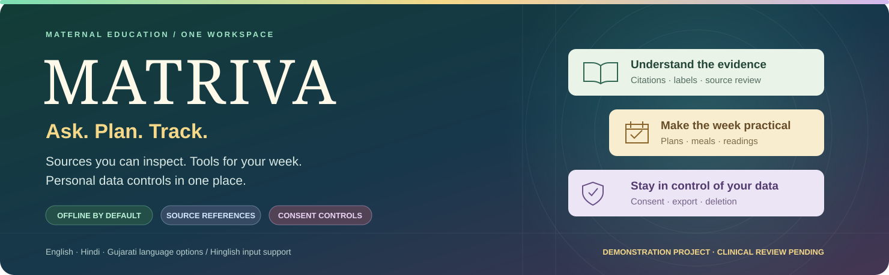
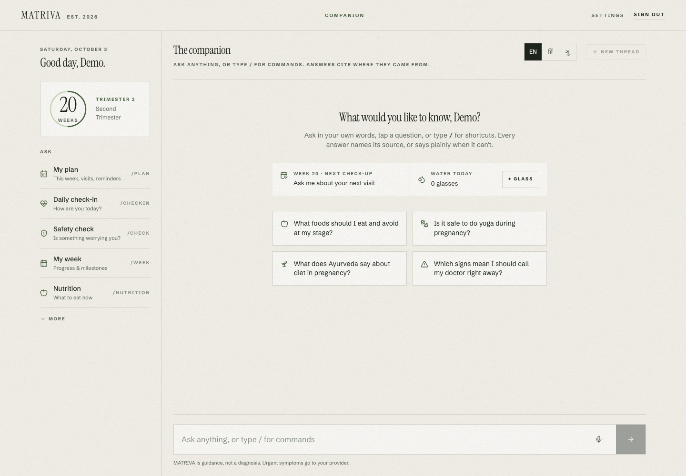

<div align="center">



# 🌿 MATRIVA — Hinglish guide

**Pregnancy ke sawaal, weekly plan aur daily records — ek hi workspace mein.**

[English](../../README.md) · [हिन्दी](./README.hi.md) · [ગુજરાતી](./README.gu.md) · **Hinglish**

</div>

> [!IMPORTANT]
> MATRIVA development aur demonstration project hai. Care rules aur safety content ka clinical review abhi pending hai. Hindi/Gujarati safety messages ko native speakers se review karwana bhi zaroori hai. App diagnosis ya medicine prescribe nahi karta, aur doctor ki jagah nahi leta. [Review requirements](../clinical-review.md) padhein.

## 💚 MATRIVA kya karta hai?

MATRIVA pregnancy education, visit planning aur daily records ko ek chat workspace mein laata hai. Mother aur unki care mein help karne wale log project ko samajh aur try kar sakte hain.

Default retrieval engine aapke computer par chalta hai; AI provider ki API key zaroori nahi hai. Normal sawaal ke liye app eligible sources se information leta hai, sources dikhata hai, ya clearly batata hai ki enough evidence nahi mila. Emergency aur prohibited requests ke liye retrieval se pehle fixed safety flow chalta hai.



## 🧭 Features kaise kholein?

| Feature | Command ya location | Kya milta hai? |
|---|---|---|
| Weekly plan | `/plan`, `/week`, `/visits` | Pregnancy week, visit schedule aur tasks |
| Daily check-in | `/checkin`, `/check`, `/log` | Daily records aur screening workflow |
| Health readings | `/readings` | Measurements, trends aur report import |
| Meals aur food guide | `/meals`, `/foods` | Meal records aur approximate nutrient information |
| Doctor summary | `/summary` | Enter kiye records se printable summary |
| Sources samjhein | `/evidence`, `/library`, `/book`, `/map` | Source references aur evidence labels |
| Apna data manage karein | Settings | Consent, JSON export aur deletion controls |

Nutrition calculations estimates hain. Care rules ka clinical review pending hai. Reminders abhi app open hone par dikhte hain; push aur SMS delivery available nahi hai.

## 🌐 App ki language support

| Language | Current behavior |
|---|---|
| English | Questions, source-based answers aur safety responses English mein |
| Hindi | Hindi questions aur translated safety/refusal messages; retrieved answers abhi English mein |
| Gujarati | Gujarati questions aur translated safety/refusal messages; retrieved answers abhi English mein |
| Hinglish | Roman Hindi ya mixed Hindi-English input; retrieved answers abhi English mein |

UI mein English, Hindi aur Gujarati ke teen language options hain. Hinglish input style hai, separate fourth UI option nahi. Yeh guide project aur setup ko Hinglish mein explain karti hai; app ke har answer ki translation nahi karti. [Language FAQ](../faq.md) dekhein.

## 🚀 Local setup

Python **3.11 ya 3.14**, Node.js **24** aur npm chahiye. Fresh setup ke liye:

```bash
git clone https://github.com/neevmodh/MATRIVA.git
cd MATRIVA/backend
python3.11 -m venv .venv
source .venv/bin/activate
python -m pip install -r requirements-dev.txt
cp .env.example .env
```

`python -c "import secrets; print(secrets.token_urlsafe(48))"` se unique secret generate karein aur `backend/.env` mein `JWT_SECRET` set karein. `RAG_ENGINE=local` rehne dein. Phir:

```bash
alembic upgrade head
uvicorn app.main:app --reload --host 127.0.0.1 --port 8010
```

Second terminal mein repository root se:

```bash
cd frontend
npm ci
printf 'NEXT_PUBLIC_API_URL=http://localhost:8010\n' > .env.local
npm run dev
```

**http://localhost:3000** open karein, account banayein aur consent ke saath profile set karein. `/plan`, `/readings` ya `/foods` try karein. Environment-file copy/write steps first setup ke liye hain; existing private settings overwrite karne se pehle check karein.

Fresh database mein approved chat corpus nahi hota. Normal question par insufficient-evidence reply aana expected hai. [Knowledge loading aur review process](../deployment.md#what-the-image-does-not-contain) follow karein. Uploaded documents pending se start hote hain; actual source review ke baad hi approve karein.

## 🔐 Consent aur privacy

Health profile aur care records save karne ke liye consent chahiye. Consent withdraw karne ya health profile delete karne se profile/care data remove hota hai, lekin chat history rehti hai. Account deletion account aur associated personal records ko remove karta hai. JSON export se apna data download kar sakte hain. [Privacy details](../privacy.md) padhein.

## 🎨 Tech aur checks

Repo mein Python, TypeScript, JavaScript, CSS, Shell, Dockerfile, Mako aur Mermaid use hote hain. Main stack Next.js, React, FastAPI, SQLAlchemy, PostgreSQL/pgvector aur Redis hai.

Saat required GitHub CI jobs hain; CodeQL separately run hota hai. Passing tests software behavior verify karte hain, clinical content ko certify nahi karte. [Testing guide](../testing.md) dekhein.

## 📚 Aur explore karein

- [Complete English README](../../README.md).
- [6 diagrams aur 13 real application screens](../../Material/README.md), synthetic personal records ke saath.
- [Architecture](../architecture.md), [API](../api.md) aur [configuration](../configuration.md).
- [Data sources](../data-sources.md), [safety](../safety.md) aur [roadmap](../roadmap.md).
- [Contributing](../../CONTRIBUTING.md) aur [security reporting](../../SECURITY.md).

Yeh introduction English README par based hai. Detailed technical guides mostly English mein hain. Repository ka license abhi select nahi hua hai.
